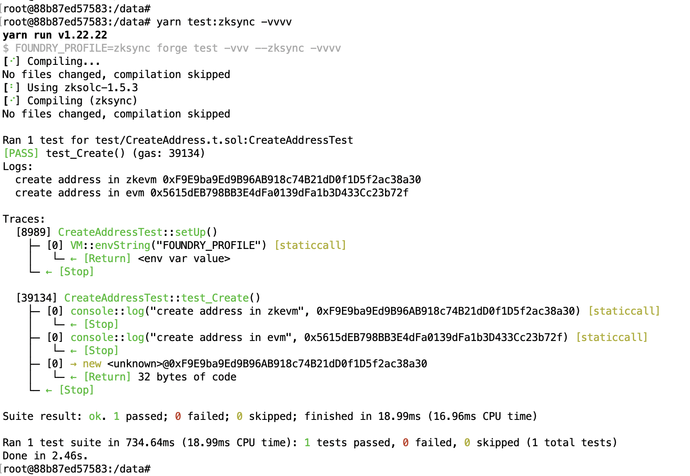
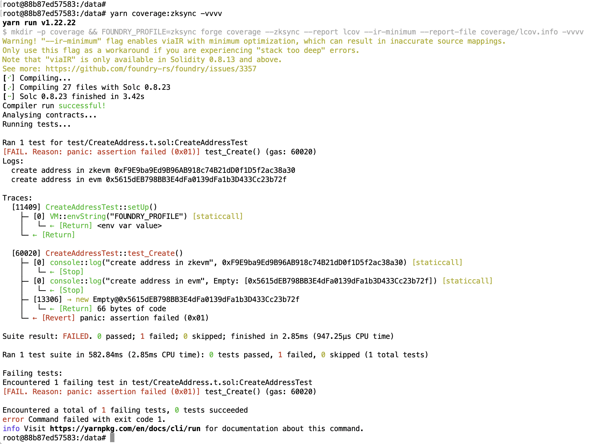

# foundry-zksync-coverage-demo

This repository demonstrates an issue with test coverage generation (`forge coverage --zksync`) in the zkSync environment, where the regular `EVM` is used instead of the expected `zkEVM`.
The project contains a simple contract with one test that verifies the address of a deployed contract using `CREATE`, and it shows that `forge coverage --zksync` for zkSync runs using `EVM` instead of `zkEVM`.

## How to Reproduce

To reproduce the issue, run the following commands:

1. **Run zkSync tests:**
   ```
   yarn test:zksync -vvvv
   ```
2. **Run zkSync test coverage:**
   ```
   yarn coverage:zksync -vvvv
   ```
   The [logs](./logs.txt) will show that the regular `EVM` is being used instead of `zkEVM`, and `new Empty()` created with `EVM`.
   
## Screenshots

In the [logs](./logs.txt) above and in the screenshots of these logs, you can see that the regular `EVM` is used in coverage mode instead of `zkEVM`, demonstrating the issue.



